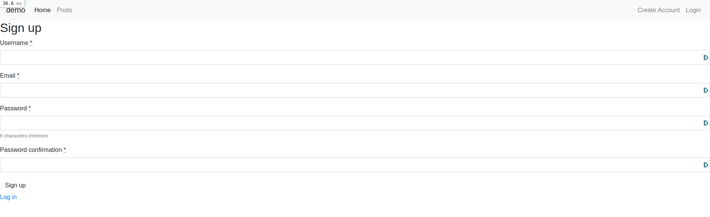

# Rails_Template
Rails template than uses Device, Bootstrap, Simpleform. Setup user with username or email. Simple navbar with toogle menu

## To use this template just run command: rails new [app_name] -m https://raw.githubusercontent.com/sergiocortessat/Rails_Template/main/devise_bootstrap_template.rb


## Table of Contents
  <br />

* [About the Project](#about-the-project)
* [Getting Started](#getting-started) 
* [Built With](#built-with)
* [Contributing](#contributing)
* [Contact](#authors)
* [Acknowledgements](#acknowledgements) 

#
<br />

[](https://forthebadge.com) </br>
 <br/>


<br />

#


<!-- ABOUT THE PROJECT   -->
## About The Project

Rails template than uses Device, Bootstrap, Simpleform. Setup user with username or email. Simple navbar with toogle menu

## Screenshot Test

<p align="center">
  
</p>

<p align="center">
  
</p>

<p align="center">
  
</p>

<p align="center">
  
</p>

## Contributing

Contributions make the open-source community such an amazing place to learn, inspire, and create. Any contributions you make are **greatly appreciated**.

## Prequisites

Ruby & Rails installed on your local machine.
bundle installed on your machine
Terminal or similar to execute the program.


## Getting Started

run command: rails new demo -m https://raw.githubusercontent.com/sergiocortessat/Rails_Template/main/devise_bootstrap_template.rb


## Note: Clone the project and set your own Custom Template on top.

- To get a local copy up and running follow these simple example steps.
- Clone this repository with git clone ```https://github.com/sergiocortessat/Rails_Template``` using your terminal or command line.
- Change to the project directory by entering: ```cd Rails_Template ``` in the terminal.


## Authors

👤 Sergio Cortes Satizabal

- Github: [@sergiocortessat](https://github.com/sergiocortessat)
- Twitter: [@sergiocortessat](https://twitter.com/sergiocortessat)
- LinkedIn: [@sergiocortessat](www.linkedin.com/in/sergio-cortes-satizabal-3b452194)

### Built With

* [RUBY]
* [RAILS]
* [DEVISE]
* [SIMPLEFORM]
* [BOOTSTRAP]

<!-- ACKNOWLEDGEMENTS -->
## Acknowledgements

* [Microverse](https://www.microverse.org/)

## 📝 License

This project is [MIT](https://github.com/sergiocortessat/sergiocortessat/blob/main/LICENSE) licensed.


